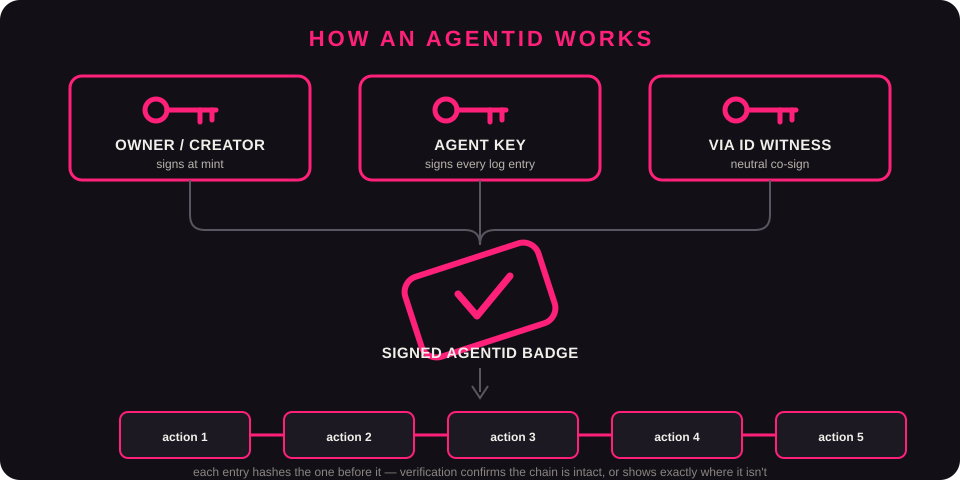

<p align="center">
  
</p>

<h1 align="center">VIA ID</h1>
<p align="center"><b>Give an AI agent a verifiable identity and a tamper-evident record of what it did.</b></p>

<p align="center">
  <a href="https://www.npmjs.com/package/viaid-skill"></a>
  <a href="https://www.npmjs.com/package/viaid-skill"></a>
  
  <a href="https://viaid.wiki"></a>
  <a href="https://viaid.ai"></a>
</p>

An **AgentID** is a small signed file: a 3-key identity (an Owner/Creator key, an Agent key,
and a neutral VIA ID "Witness" co-signature) plus a hash-chained log the agent appends to as
it acts. Anyone can verify a badge offline — no VIA ID server required to check it, only to
mint or co-sign a new one.

VIA ID answers **"what did this agent do, and can I trust the record?"** — not who the agent
is (that's Okta/identity providers), not its name (Agent Name Service), not who owns it
(GLEIF-style registries), not how it pays (AP2). One narrow job, done honestly.

**Claim discipline:** VIA ID says "tamper-evident" — if the log is altered, verification shows
it — and never "tamper-proof," "tamper-safe," "certified," or "compliant." A `verify` result
reports what it actually checked (signatures, log-chain integrity, key-rotation history) and
its assurance tier, not a blanket claim about the agent's safety or behavior.

<p align="center">
  
</p>

## The gap this closes

|  | **Without VIA ID** | **With VIA ID** |
|---|---|---|
| **Identity** | No standard signed identity for the agent; whatever it claims is unverified. | A 3-key signed AgentID (owner key, agent key, VIA ID Witness co-signature). Verifies offline. |
| **Action record** | Logging, if it exists, is internal to whoever built the agent and unverifiable by anyone else. | A hash-chained log the agent appends to. Any alteration is detectable at `verify` time. |
| **Verdict** | No standard verdict format; every integrator invents their own check. | Five defined states — VALID, STALE, REVOKED, UNKNOWN, INVALID — with coverage and an assurance tier. |
| **Revocation** | Ad hoc: block an IP, rotate a credential, hope the access surface is fully covered. | Revoke the badge; any gate checking it refuses that agent going forward. Doesn't halt a process already running. |
| **Key compromise** | Depends entirely on the integrator's own key-management practice. | `rotate` issues a new signing key through a pre-committed chain while `agent_id` never changes, so downstream parties don't lose the thread. |

*None of this makes an agent safe. It makes what it did checkable — only 44% of organizations report having security policies in place for the AI agents already running inside them, and only 10% report a well-developed strategy for managing non-human identities at all. ([SailPoint, 2025](https://investor.sailpoint.com/news-releases/news-release-details/sailpoint-research-highlights-rapid-ai-agent-adoption-driving) · [Okta, "AI at Work 2025"](https://www.okta.com/newsroom/articles/ai-at-work-2025--securing-the-ai-powered-workforce/))*

## 60-second start

**Fastest — published to npm, no clone needed:**

```bash
npx viaid-skill
```

**Via the Agent Skills registry:**

```bash
npx skills add SathiaAI/viaid
```

**From a clone of this repo:**

```bash
node scripts/install.js
```

All three auto-detect Claude Code, Codex CLI, Gemini CLI, Cursor, and Windsurf on your machine
and copy the skill into each one's skills directory. Takes under a second.

```bash
node bin/viaid.mjs init "my-agent"            # mint a badge once, when the agent ships (SELF tier)
node bin/viaid.mjs init "my-agent" --witnessed # same, but registers with the hosted Witness Service
node bin/viaid.mjs log <id> "did-thing"       # the agent's own runtime calls this after each action
node bin/viaid.mjs verify <id>                # check a badge — VALID / STALE / REVOKED / UNKNOWN
node bin/viaid.mjs rotate <id> [reason]       # rotate the agent key on schedule or after compromise
```

See it work end-to-end in under a minute: [live public demo](https://sathiaai.github.io/viaid-demo/).

See `SKILL.md` for the full instructions an AI coding agent follows when this skill is
installed — phased guidance (mint once, log every action, optionally present the badge to a
receiving party via headers, verify before shipping), plus an explicit "what NOT to do"
section. A live public verify page: [viaid.ai](https://viaid.ai).

## What's in here

| File | Job |
|---|---|
| `SKILL.md` | The skill definition an AI coding agent reads. |
| `bin/viaid.mjs` | The CLI (`init` / `log` / `verify` / `revoke` / `rotate`). |
| `src/agentid.mjs` | The badge core: mint, sign, verify, key rotation, offline freshness states (FRESH/STALE/REVOKED/UNKNOWN). Zero external dependencies — just `node:crypto`. |
| `src/verify-page.mjs` | Renders a badge's verdict as a readable page/summary. |
| `src/adapters/` | Optional integrations (GraphSmith, KnoSky) — no-ops if those tools aren't present; this skill never requires them. |
| `lib/attach.mjs` | `viaHeaders(badgePath)` for an agent to present its badge to a receiving party over HTTP. A header is a pointer, not a proof — the receiving party still has to call `verify()` itself. |
| `scripts/install.js` | The installer. |

## What VIA ID does NOT do

- Does not certify an agent as safe, compliant, or "approved" in any general sense.
- Does not halt or remote-terminate a running process — revoke changes what a gate does on the
  *next* check, not what's already executing.
- `verify` reports coverage of what passed through the recorder, never a claim about everything
  the agent did outside VIA ID's visibility.
- Does not resolve *who* an agent is allowed to act as (that's an identity provider like Okta),
  its *name* (Agent Name Service), *who owns it* (GLEIF-style registries), or *how it pays*
  (AP2) — VIA ID answers one question and says so plainly rather than reaching past it.
- Capability claims ("approved for X") only carry weight when backed by an actual evaluation
  (GraphSmith-backed `eval`) — a self-declared capability has zero verification weight.

## FAQ

**Do I need a VIA ID account to create a badge?**
No. The CLI needs zero account, zero API key, and makes zero network calls. The browser flow at
[viaid.ai](https://viaid.ai) also needs no account — keys are generated client-side and only
public keys/signatures ever reach the server.

**Should I mint a badge once per agent, or once per run?**
Once per agent, when it's built or about to ship — not once per run. `agent_id` identifies the
agent across its whole lifetime.

**Do I have to log every single action my agent takes?**
No — log actions a human would want an audit trail for (an API call, a file write, a decision
with real consequences), not every internal model thought. Wrapping every function call in
`log` is noise, not a record.

**Can a badge be faked?**
A forged or altered badge fails at least one verification step — the identity hash won't match,
a signature won't check out, or the log's hash chain will break at the altered entry.

**Do I need to trust VIA ID (the company) to verify a badge?**
No. Verification is fully offline once you have the badge file or its rendered page —
`verify` doesn't call any VIA ID server to check signatures or log integrity. Only *minting* or
*co-signing a new* badge needs the hosted Witness Service.

**What if GraphSmith or KnoSky aren't installed?**
`init`, `log`, `verify`, and `rotate` work standalone with zero dependencies. `eval` and `gate`
throw explicitly if their dependency isn't available, rather than silently skipping.

More questions: [viaid.wiki/docs/faq](https://viaid.wiki/docs/faq).

## Roadmap

**Shipped:** the four core commands (`init`/`log`/`verify`/`rotate`) with KERI-style key
pre-rotation and offline freshness states (FRESH/STALE/REVOKED/UNKNOWN).

**Designed and approved, not yet built:** per-role independent revocation (owner/agent/voucher
can each revoke without needing the others' cooperation), a code/model integrity commitment for
detecting agent mutation, and two enforcement paths — an SDK/middleware package and a hosted
reverse-proxy — for teams without their own API gateway to plug into.

No dates or guarantees attached to any of the above — this list changes as real usage informs
priority, and nothing here is described as shipped until it verifiably is.

## Status

Early. Built and dogfooded (mint → log → verify → rotate end-to-end), not yet widely used.
Deterministic adversarial checks pass; a model-driven adversarial harness runs alongside them
and any open findings are tracked before being claimed as resolved. Feedback and issues welcome.

## License

MIT — see `LICENSE`.
